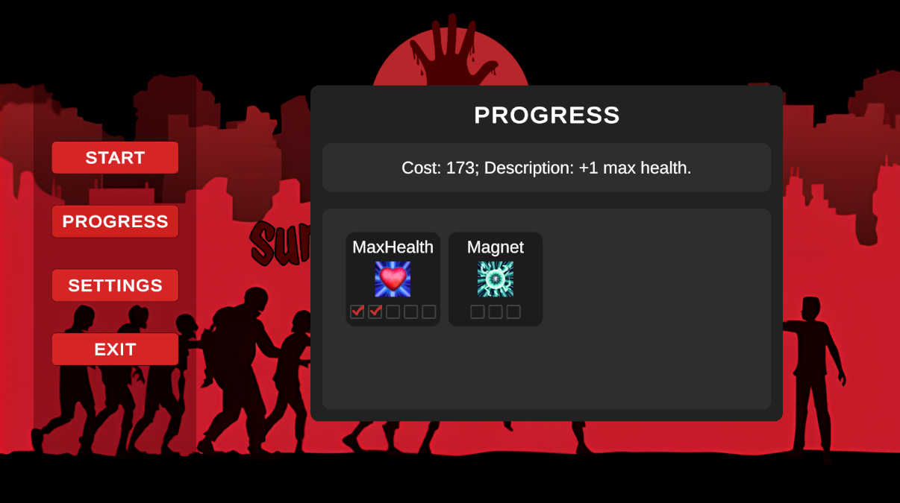
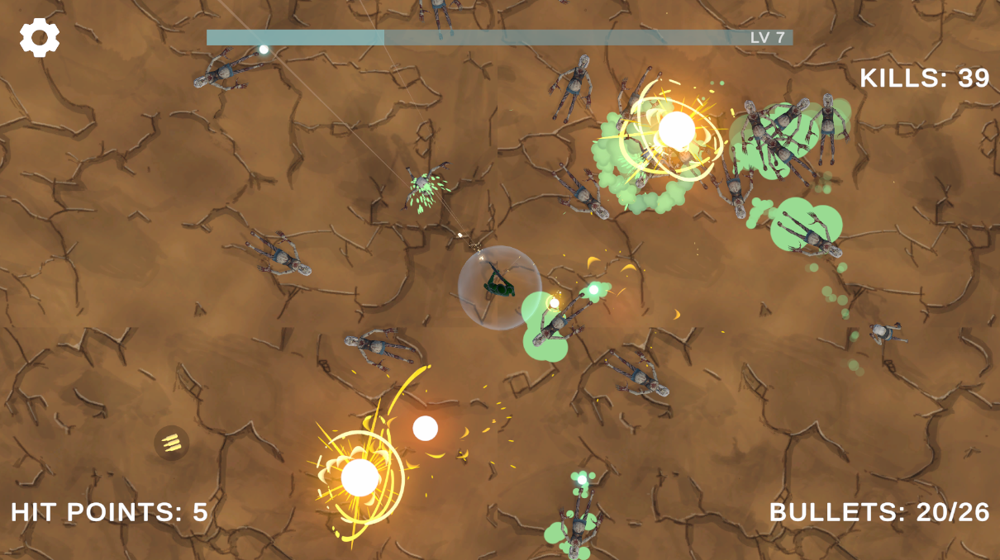
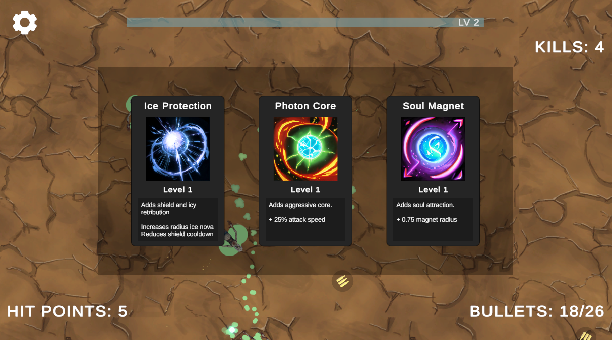

# !EXPERIMENTAL! Atomic Oriented Design (AOD)

### Описание
Демо игра в жанре shoot ’em up и roguelike, написанная на Атомарном подходе Игоря Гулькина. AOD представляет собой совокупность декларативного описания ядра модели и Entity-Component подхода.

### Особенности
- Атомарный подход
- Загрузка через ассинхронные таски
- Сохранение и загрузка данных
- Система прокачки навыков
- Мета-прогресс
- Иерархические машины конечных состояний (HFSM)
- Разделение слоев бизнес логики, представления (view) и данных
- Анимационные слои и эффекты

### DI System
- Zenject

### Примененные принципы
- ООП
- SOLID
- DRY
- KISS
- YAGNI 

### Примененные паттерны
- State (GoF)
- Composite (GoF)
- Mediator (GoF)
- Template Method (GoF)
- Information Expert (GRASP)
- Creator (GRASP)
- Controller (GRASP)
- Low Coupling / High Cohesion (GRASP)
- Pure Fabrication (GRASP)
- Polymorphism (GRASP)
- Indirection (GRASP)
- Protected Variations (GRASP)
- Model View Observer (MV*)
- Presentation Model (MV*)
- MVP-Passive (MV*)

### Плагины
- Odin Inspector
- DOTween

### Управление
- W, A, S, D - ходьба
- LBM - выбор улучшений

### Скриншоты
\
\
\
